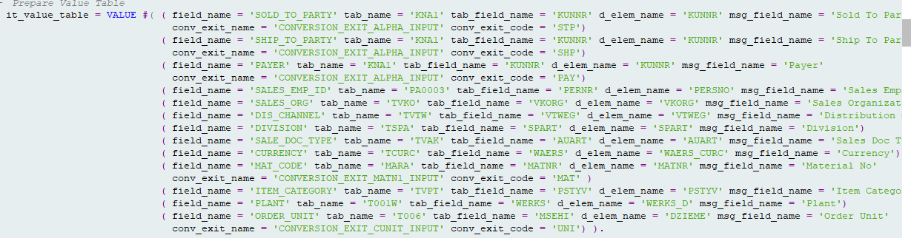

# Input Validation Solution Using Dynamic Programming in ABAP
##  Problem Statement
Allowing junk values in a table is one of the worst practices in any database, as it can cause a butterfly effect, impacting areas we did not expect. In my case, this was observed with SAP custom tables. For example, the column BUKRS, which refers to the standard T001 table with a standard data element, domain, and check table, can still accept incorrect values. If an invalid value is entered and directly used in an open SQL query, it will not be restricted. While restricting such values is not difficult—since we just need to check before updating—the issue arises when the table has multiple columns. We would have to check each column for every row, which becomes time-consuming. Due to tight timelines, we often overlook this small but crucial detail.

The thing is, we can't manually develop a solution for each case, especially when dealing with a large number of tables and columns. That's why I thought of developing a dynamic solution that could handle this efficiently. The solution is simple: specify which column needs to be compared with which standard table column, and if the value doesn't match, throw an error. The only thing that changes is the table name and column name. To address this, I developed a solution using dynamic programming and RTTs.

**Note: This solution is particularly useful for validating master data that changes infrequently, such as company codes, currencies, customers, etc. Many of these tables are fully or partially buffered, so performance won't be significantly impacted when using OPEN SQL. However, it is not recommended for comparing transactional data. A good example would be comparing the BELNR field in the BSEG table**

## Solution Description
This solution addresses the challenge of validating internal or work area data before storing it into a database table. Not all fields are free input, and the traditional method of validation involves fetching check values from the database and comparing them row by row for each column. While simple, this approach can be very time-consuming for consultants. What if we could automate this process by simply specifying, "compare this field with this table and tell me if it contains an invalid value"? This is the goal of this solution.

## Features
1. Dynamically validate any internal table or work area with minimal information.
2. It will not validate internal tables and work areas. It validates deep structures (e.g., internal table inside an internal table, work area inside an internal table, internal table inside a work area, work area inside a work area, etc.).
3. Do the conversion exit and give unconverted value for storing
   
## Instructions
1. Create the class in SE24.
2. Call it with the necessary format. That's it.

## Technologies Used
- ABAP
  
## Usage
1. Create a value table as shown in the image. The "Field Name" refers to the field name in the internal table or work area you are passing. The "Table Name" is the check table, and the "Table Field Name" is the field to be checked in the check table. The "Data Element Name" refers to the data element, while the "Msg Field Name" is for message purposes only and will not affect the functionality. The "Conv Exit Name" is optional and should be provided if applicable.

2. Call the `validate` method with the required internal table or work area.  
3. You will receive the output. The `Err_Message` attribute will indicate any invalid values, and the `Converted_Out` attribute will list any unconverted values.  

For documentation purposes, I have attached different output screenshots for each step, so don't be confused by them.

## Contribution
- The solution does not support validation when multiple primary keys are involved. For example, house bank and account ID cannot be validated together; they will be validated independently.
- It does not specify which records contain incorrect values. The results are returned in a static manner.
